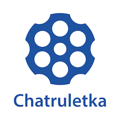
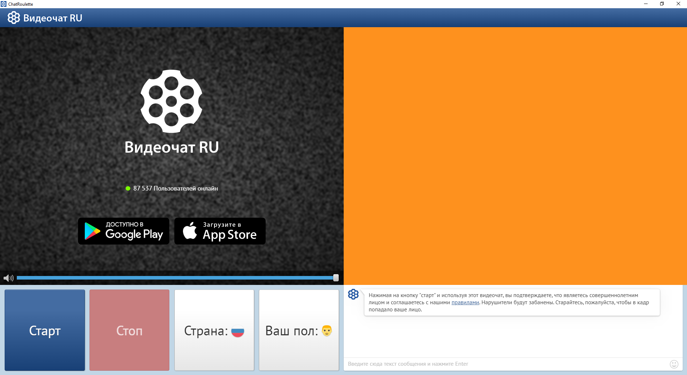
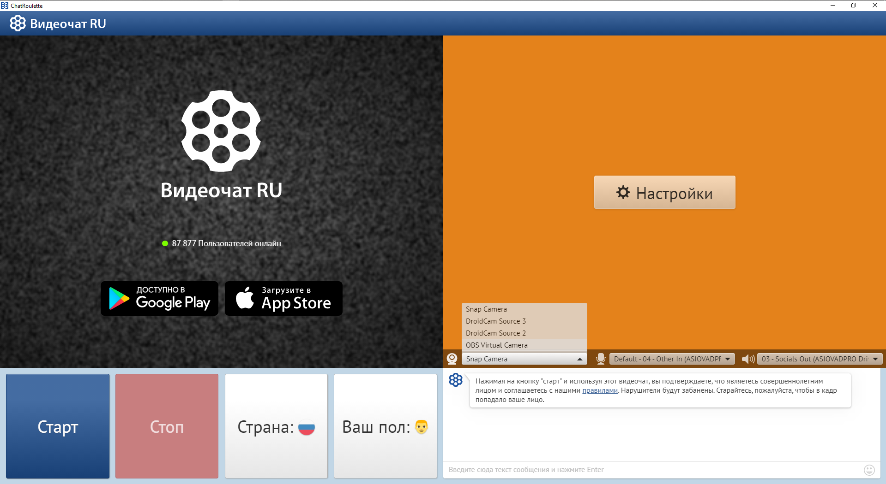

[](https://videochatru.com/)

Неофициальный десктопный клиент чат рулетки, который прекрасно подойдет для тех, кому нужно намеренно направить звук с чат рулетки в программу захвата звука, для тех, кто использует обработку видео в чате, для тех, у кого стоит DroidCam, ManyCam и прочая дичь, улучшающая изображение и для тех, у кого есть микрофон, из-за которого не пускают в чат рулетку. 

- Нет необходимости устанавливать
- Работает независимо от операционной системы
- Не обращает внимание на присутствующие камеры
- Убрана реклама и прочая лишняя информация

Загрузить можно [тут](/releases/latest)

# Сборка под Windows

```bash
> npm install
> npm run build-windows
```

# Сборка под Linux

```bash
> npm install
> npm run build-linux
```

# Сборка под MacOS

```bash
> npm install
> npm run build-mac
```

# Запуск в режиме отладки

```bash
> npm install
> npm start
```

# Установка с npm
```bash
> npm i -g chatroulette
> chatroulette
```

# Скриншоты

>
> 
>
> 
> 
